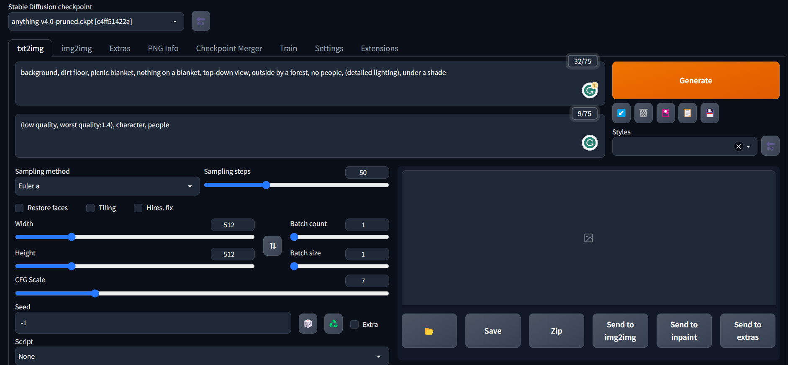

# The Journey of Legolas - GAME 450 Final

*Xavier Zhang*

*May 2nd, 2023*

# 1. Abstract

The Journey of Legolas is a game that aims to demonstrate the potential benefits of incorporating artificial intelligence (AI) into gaming experiences. Its primary objective is for players to earn a sufficient amount of in-game currency by navigating various cities and engaging in combat with thieves. While the gameplay may seem simplistic, it serves as an ideal foundation for exploring how AI can enhance the game's assets, texts, and city location optimization.

To optimize the game's visual components, sprites, and backgrounds can be generated using deep-learning image-to-text models, specifically, Stable diffusion due to its availability and compatibility with open-source models available on Huggingface. The text generation feature of the game is improved with ChatGPT's cost-effectiveness and ease of implementation through its API key. The chatbot function of ChatGPT further enhances the game's ability to generate realistic and accurate texts based on specified prompts. The city landscape is optimized using a genetic algorithm model that allows for the implementation of various constraints and improves the game's overall location generation.

Overall, The Journey of Legolas serves as a proof of concept for incorporating AI into gaming experiences and demonstrates the potential improvements to a player's experience through enhanced game assets, texts, and location generation.

# 2. Artificial Intelligence Components

1. Text Generation
2. Asset Generation
3. City Location Optimizer

# 3. Solutions

## 3.1 Text Generation

The game presents a challenge in the form of a limited variety of character and opponent quotes during the battle phase. Although a theoretical solution of hard-coding all the quotes and using a random choice algorithm could be implemented, it would result in repeated quotes each time the game is replayed. To overcome this challenge, an optimal solution would be to use ChatGPT's state-of-the-art gpt-3.5-turbo model, which leverages deep learning techniques to generate human-like text from input text.

By providing an input text prompt that outlines the general idea of the desired quote and constraints, the model can generate unique and contextually relevant quotes for each game. For example, an input text prompt like "give me a single quote, max 7 words, for a provocative message for 'I will win in rock paper scissors!'" would specify the desired length and context. The gpt-3.5-turbo model can then generate an output message like "My strategy: predict your next move". This approach significantly increases the variety in the text during the battle phase and ensures a more engaging gameplay experience.

## 3.2 Asset Generation

The game's physical limitations arise from the creator's capacity to develop game assets, such as character sprites and backgrounds. While open-source assets may serve as substitutes, they fail to meet the specific requirements of the game. However, the use of artificial intelligence can overcome this limitation by generating creative and precise assets. One such model is Stable Diffusion, a deep learning text-to-image model that generates assets based on positive and negative text prompts.

The game requires anime-style assets, and Stable Diffusion offers a range of open-source models. The chosen model, anything-v4.0, is a latent diffusion model for anime-style artwork, which maps the latent space of an image generator network to the space of text descriptions. The model generates four specific assets for the game: the player (Legolas), a thief, a combat surface, and a journal surface.

Stable Diffusion allows users to adjust settings and prompts for asset generation. For instance, the combat surface requires a forest background, and the positive prompt includes detailed lighting. The negative prompt is set to remove any low-quality artwork from the generated combat surface. The Classifier Free Guidance (CFG) Scale, which determines how closely the model follows the text prompts, was adjusted to 9 from the default value of 7, to achieve better results. However, any increase beyond 9 resulted in undesirable outcomes. The sampling size was also increased to 70 from the default value of 20, which provided optimal computational time and output quality.

## 3.3 City Location Optimizer

The selection of city locations in a generated landscape surface was previously performed at random, resulting in the awkward placement of cities in high-elevation mountains, low-elevation lakes, and in close proximity to other cities. To address these undesired outcomes, a Genetic Algorithm model was employed.

The genetic model operates by randomly changing city locations based on previous iterations of city mapping while scoring each mapping using a fitness function that considers elevation and penalizes city locations in high and low elevations. Additionally, the function penalizes shorter Euclidean distances between cities. The genetic algorithm iteratively improves upon the previous mappings, selecting those with higher fitness scores and eventually arriving at the optimal city mapping after a fixed number of iterations. This approach effectively mitigates the issues of awkward city placement and enhances the overall quality of the generated landscape surface.

# 4. Implementation

## 4.1 ChatGPT

Using ChatGPT on Python requires the use of the API. Figure 4.1.1 shows the method used to connect to the ChatGPT AI given an API key. 

```python
import openai
key = "**************************************"

def connection(key):
    OPENAI_API_KEY = key
    openai.api_key = OPENAI_API_KEY
```

After establishing a connection, you can directly input text into the model and receive an output text. Figure 4.1.2 shows the method used to input the message and receive the output.

```python
def ask_ai(messages): 
    response = openai.ChatCompletion.create(
        model="gpt-3.5-turbo",
        max_tokens=1000,
        temperature=1.0,
        messages = messages
    )
    return response["choices"][0]["message"]["content"]
```

Specialized messages tailored toward the game prompts are used. Figure 4.1.3 shows these methods that input specific messages and return a response from the gpt-3.5-turbo model.

```python
def bot_provoke_message():
    connect = connection(key)
    prompt = [{"role": "user", "content": "give me a single quote, max 7 words, for a provocative message for 'I will win in rock paper scissors!'"}]
    response = ask_ai(prompt)

    return response

def player_provoke_message():
    connect = connection(key)
    prompt = [{"role": "user", "content": "give me a single quote, max 7 words, for a provocative message for 'I will not lose either!'"}]
    response = ask_ai(prompt)
```

To increase runtime efficiency, all messages can be generated at the start of the game. The methods in Figure 4.1.4 preload messages and store them in a list.

```python
def player_taunt_pool():
    count = 0
    messages = []
    while count <4:
        messages += [player_provoke_message()]
        count += 1
    return messages

def bot_taunt_pool():
    count = 0
    messages = []
    while count <4:
        messages += [bot_provoke_message()]
        count += 1
    return messages
```

## 4.2 Stable Diffusion

Anything-v4.0 was used as the latent diffusion model for Stable Diffusion. For the text-to-image generation, parameters that were added and adjusted include the positive prompts, negative prompts, sampling steps, and CFG Scale. Figure 4.2.1 shows the user interface of Stable Diffusion’s text-to-image model. Figure 4.2.2 shows an example of a text-to-image generated image.



Figure 4.2.1 Text-to-Image User Interface


Figure 4.2.2 Text-to-Image Picnic Blanket

For the image-to-text generation, parameters that were added and adjusted include the positive prompts, negative prompts, sampling steps, and CFG Scale. The difference is that the model can take an input image and generate a positive prompt for the image. The model can then use this prompt (alongside your modifications to the prompt) and generate an entirely new image from it. Figure 4.2.3 shows the user interface of Stable Diffusion’s image-to-text model. Figure 4.2.4 shows an example of a before and after image-to-text generated image.


Figure 4.2.3 Image-to-Text User Interface


4.2.4 Image-to-Text Thief

## 4.3 Genetic Algorithm

A genetic algorithm was used to optimize city mapping on the landscape surface. Randomly generated city locations often led to poor placement of cities, as seen in Figure 4.3.1. The cities are unevenly distributed and are located at high elevations. 


Figure 4.3.1 Randomly Generated City Mapping

The fitness function, Figure 4.3.2, is created to punish poorly placed cities. Cities that are above 0.65 elevation are considered too high and below 0.55 elevation are considered too low. The function also punishes city mappings that put cities close to one another, favoring mappings that have cities that are evenly spread out.

```python
def game_fitness(cities, idx, elevation, size):
    fitness = 0.00001  # Do not return a fitness of 0, it will mess up the algorithm.
    """
    Create your fitness function here to fulfill the following criteria:
    1. The cities should not be underwater
    2. The cities should have a realistic distribution across the landscape
    3. The cities may also not be on top of mountains or on top of each other
    """
    city_array = solution_to_cities(cities, size)

    for (x,y) in city_array:
        #checking if cities are underwater (if elevation is under 0.55, it's considered under water) and cities are on top of mountains (if elevation is above 0.65, its considered on mountain)
        if ((elevation[x][y]> 0.55) & (elevation[x][y]< 0.65)):
            fitness += 0.1
        else:
            fitness += 0.01

        #checking if cities are too close to each other or on top of each other
        #on top will check if the cities are on top of each other. If the number is 2 or greater, that means there is 1 or more on top of each other since there will always the city itself matching itself.
        on_top = 0
        #shortest distance is the shortest Euclidean distance between a city. If the number is smaller, the less fitness it will receive.
        shortest_distance = 1000000
        for (a,b) in city_array:
            if (x,y) != (a,b):
                if (distance.euclidean((x,y),(a,b)) < shortest_distance):
                    shortest_distance = distance.euclidean((x,y),(a,b))
            else:
                on_top += 1

        fitness += (0.02*shortest_distance)
        
        if on_top >=2:
            fitness += 0.00001
        else:
            fitness += 1

    return fitness
```

When running the genetic algorithm in an iterative loop, the mapping with the higher fitness value survives while lower-fitness city mappings are removed. In Figure 4.3.3, we can see the fitness value compared with each iteration of the algorithm. 


Figure 4.3.3 Generation vs. Fitness

The final mapping results in fewer undesirable traits, as seen in Figure 4.3.4.


Figure 4.3.4 Genetic Algorithm Generated City Mapping

# 5. Appendix

## 5.1 ChatGPT

### 5.1.1 Prompt Inputs

1. Give me a single quote, max 7 words, for a provocative message for 'I will win in rock paper scissors!
2. Give me a single quote, max 7 words, for a provocative message for 'I will not lose either!'

### 5.1.2 Example Output Prompts

1. My strategy: predict your next move.
2. Challenge accepted, let's see who wins.

## 5.2 Stable Diffusion

### 5.2.1 Legolas


Figure 5.2.1 Legolas

Positive Prompt: elf, sprite, bow and arrow, transparent background, full body, green long dress, fully clothed, girl

Negative Prompt: (low quality, worst quality:1.4), man, deformed, extra arms, deformed fingers

### 5.2.2 Thief


Figure 5.2.2 Thief

Positive Prompt (modified from image-to-text): a male character with a mask and a sword in his hand and a knife in his other hand, with a red bandana mask, transparent background

Negative Prompt: (low quality, worst quality:1.4), women, deformed, extra arms, deformed fingers

### 5.2.3 Forest Background


Figure 5.2.3 Forest Background

Positive prompt: forest, tree, dirt trail, realistic, (detailed lighting), grass, sunlight shine, shadows

Negative prompt: (low quality, worst quality:1.4), people, person

### 5.2.4 Picnic Background


Figure 5.2.4 Picnic Background

Positive prompt: background, dirt floor, picnic blanket, nothing on the blanket, top-down view

Negative prompt: (low quality, worst quality:1.4), people, people